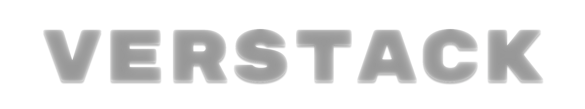

**verstack 3.8.16** is a set of Machine learning tools to make a Data Scientist's work efficient.

The package contains multiple tools for: training & tuning machine learning models, creating ensembles, working with datetime objects, data transformation & wrangling, imputing missing values, concurrency work and many more.

Please refer to the `official documentation <https://verstack.readthedocs.io>`_ for more information.

The project was created by Danil Zherebtsov in 2020.

It is currently maintained by a single contributor with occasional contributions by the active members of the community.

Installation
~~~~~~~~~~~~

.. code-block:: console

  $ pip install verstack
  $ pip install --upgrade verstack

Dependencies
------------

- Python (>= 3.6)
- numpy
- pandas<=2.0.3
- xgboost
- scikit-learn>=0.23.2,<=1.1.3
- lightgbm>=3.3.0,<=4.0.0
- optuna>=2.10.0,<=3.2.0
- plotly>=5.3.1,<=5.11.0
- matplotlib
- python-dateutil>=2.8.1,<=2.8.2
- holidays==0.11.3.1
- mlxtend
- tensorflow>=2.6.0,<=2.13.*0*
- keras>=2.6.0,<=2.13.*
- category_encoders>=2.4.0,<=2.5.1
- fastparquet

=======

Development
-----------

I welcome new contributors of all experience levels. verstack community goals are to be helpful, welcoming, and effective.
`Development Guide <https://scikit-learn.org/stable/developers/index.html>`_
based on scikit-learn best practices has detailed information about contributing code, documentation, tests, and more. 

Important links
---------------

- Official source code repo: https://github.com/DanilZherebtsov/verstack
- Issue tracker: https://github.com/DanilZherebtsov/verstack/issues

Source code
-----------

You can check the latest sources with the command::

    git clone https://github.com/DanilZherebtsov/verstack.git

Submitting a Pull Request
-------------------------

Before opening a Pull Request, have a look at the full Contributing page to make sure your code complies
with the following guidelines: https://scikit-learn.org/stable/developers/index.html

Communication
-------------

- Author email: danil.com@me.com
- `Author profile <https://www.linkedin.com/in/danil-zherebtsov/>`_
 
Citation
--------

If you use verstack in a media/research publication, we would appreciate citations to this repository.